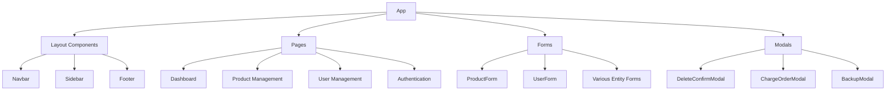
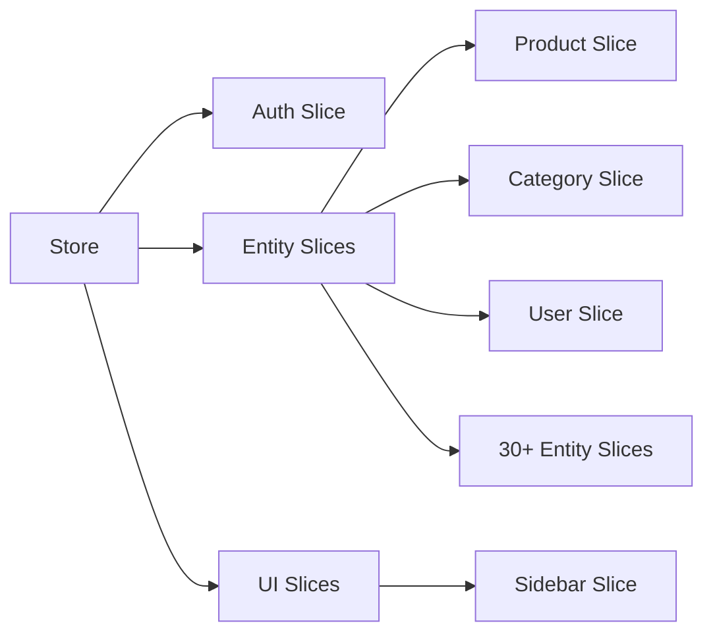

# Frontend Code Quality Assessment & Bug Analysis

## Overview

This document provides a comprehensive analysis of the React-based frontend application for the PHP GMS (Goods Management System). The assessment identifies code quality issues, potential bugs, architectural concerns, and recommendations for improvement.

## Technology Stack

- **Framework**: React 18.3.1 with Vite
- **State Management**: Redux Toolkit (RTK)
- **UI Framework**: Ant Design 5.22.1
- **HTTP Client**: Axios
- **Routing**: React Router DOM
- **Styling**: Tailwind CSS
- **Build Tool**: Vite

## Architecture Analysis

### Component Structure


### State Management Architecture


## Critical Issues Identified

### 1. Missing Dependencies & Broken Imports

**CRITICAL: useError Hook Import Issues (IMMEDIATE FIX REQUIRED)**

**Issue**: 25+ files import `useError` hook without proper file extension
```javascript
// Found in multiple files:
import useError from '../../hooks/useError'; // INCORRECT - Should be useError.jsx
```

**Impact**: Runtime errors in production builds and module resolution failures

**Affected Files:**
- `src/components/AsyncSelect/AsyncSelectNoPaginate.jsx`
- `src/components/AsyncSelect/index.jsx` 
- `src/components/AsyncSelectEvent/AsyncSelectEventNoPaginate.jsx`
- `src/components/AsyncSelectEvent/index.jsx`
- `src/components/AsyncSelectLedger/AsyncSelectNoPaginate.jsx`
- `src/components/AsyncSelectLedger/index.jsx`
- `src/components/AsyncSelectSpecial/AsyncSelectSpecialNoPaginate.jsx`
- `src/components/AsyncSelectSpecial/index.jsx`
- `src/components/Form/ChargeOrderForm.jsx`
- `src/components/Form/EventForm.jsx`
- `src/components/Form/GoodsReceivedNoteForm.jsx`
- `src/components/Form/IJOForm.jsx`
- `src/components/Form/OpeningStockForm.jsx`
- `src/components/Form/PickListForm.jsx`
- `src/components/Form/PurchaseInvoiceForm.jsx`
- `src/components/Form/PurchaseOrderForm.jsx`
- `src/components/Form/PurchaseReturnForm.jsx`
- `src/components/Form/QuotationForm.jsx`
- `src/components/Form/SaleInvoiceForm.jsx`
- `src/components/Form/SaleReturnForm.jsx`
- `src/components/Form/ShipmentForm.jsx`
- `src/components/Form/stockReturnForm.jsx`
- `src/components/Layout/Sidebar.jsx`
- `src/components/Menu/ProfileMenu.jsx`
- `src/components/Modals/AnalysisModalChargeOrder.jsx`

**Required Fix:**
Replace all instances of:
```javascript
import useError from '../../hooks/useError';
```
With:
```javascript
import useError from '../../hooks/useError.jsx';
```

**Quick Fix Commands:**
1. For 2-level imports: Find `import useError from '../../hooks/useError';` → Replace with `import useError from '../../hooks/useError.jsx';`
2. For 1-level imports: Find `import useError from '../hooks/useError';` → Replace with `import useError from '../hooks/useError.jsx';`

**Solution**: Update all imports to include the `.jsx` extension or configure module resolution

### 2. Inconsistent Error Handling

**Problem**: The `useError` hook has multiple error handling paths that may conflict:
```javascript
// From useError.jsx - Multiple overlapping conditions
if (error?.response?.status === 401) {
  // Handle auth
} else if (error?.message === 'Network Error') {
  // Handle network
} else if (error?.response?.data?.status_code === 500) {
  // Handle server error
} else if (errorMessage?.error) {
  // Handle API error
} else if (errorMessage?.message) {
  // Handle message error
}
```

**Issues**:
- Redundant error checking logic
- Potential for falling through multiple conditions
- Inconsistent error message extraction

### 3. Store Configuration Issues

**Problem**: Missing reducers in store configuration
```javascript
// store/index.js - Line 34: serviceOrderReducer imported
import serviceOrderReducer from './features/ServiceOrder';

// But references missing slice files:
import CompanySettingReducer from './features/companySetting';
```

**Missing Files**: 
- `ServiceOrder.js` (referenced but may not exist)
- `companySetting.js` (referenced but may not exist)

### 4. Async Component Loading Issues

**Problem**: In `AsyncSelect` components, there are race conditions and memory leaks:
```javascript
// AsyncSelect/index.jsx
useEffect(() => {
  if (isClicked) {
    setOptions([]);
    setPage(1);
    fetchData(debouncedSearch, 1);
  }
}, [debouncedSearch, isClicked, ...dependencies]);
```

**Issues**:
- No cleanup for ongoing requests
- Potential memory leaks when component unmounts
- Race conditions when rapid typing occurs

### 5. Authentication State Management

**Problem**: Inconsistent user data handling in auth slice:
```javascript
// authSlice.js
const user = localStorage.getItem('user') ? JSON.parse(localStorage.getItem('user')) : null;

// Later in fulfilled cases:
const { api_token, ...user } = action.payload;
localStorage.setItem('token', api_token);
localStorage.setItem('user', JSON.stringify(user));
state.user = user;
```

**Issues**:
- No error handling for JSON.parse
- Potential for corrupted localStorage data
- Token and user data stored separately creating sync issues

### 6. Form Validation Inconsistencies

**Problem**: Inconsistent validation patterns across forms:
```javascript
// ProductForm.jsx - Some validations missing
<Form.Item 
  name="short_code" 
  label="Short Code">
  <Input />
</Form.Item>
```

**Issues**:
- Missing required field validations
- No consistent validation schema
- Client-side only validation without server-side sync

## Performance Issues

### 1. Unnecessary Re-renders

**Problem**: Category slice updates cause unnecessary re-renders:
```javascript
// categorySlice.js
updateCategoryListValue: (state, action) => {
  const { id, field, value } = action.payload;
  state.list = state.list.map((item) => {
    if (item.category_id === id) {
      return { ...item, [field]: value };
    }
    return item; // Creates new objects unnecessarily
  });
}
```

### 2. Inefficient API Calls

**Problem**: No request caching or deduplication in async selects:
```javascript
// AsyncSelect components make duplicate API calls
fetchData(debouncedSearch, 1); // No caching mechanism
```

### 3. Large Bundle Size

**Issues**:
- All Redux slices loaded at once (30+ slices)
- No code splitting for large form components
- Ant Design components not tree-shaken properly

## Security Concerns

### 1. Token Storage

**Problem**: Sensitive data stored in localStorage:
```javascript
localStorage.setItem('token', api_token);
localStorage.setItem('user', JSON.stringify(user));
```

**Risk**: XSS attacks can access tokens
**Recommendation**: Use httpOnly cookies or sessionStorage with proper CSP

### 2. API Base URL Configuration

**Problem**: Dynamic API URL loading without validation:
```javascript
// axiosInstance.js
const response = await fetch(`${import.meta.env.VITE_BASE_URL}/config.json`);
const config = await response.json();
API_URL = config.baseURL; // No validation
```

**Risk**: Potential for URL injection attacks

### 3. File Upload Security

**Problem**: Image upload without proper validation:
```javascript
// ProductForm.jsx
const handleImageChange = (e) => {
  const file = e.target.files[0];
  if (file) {
    const reader = new FileReader();
    reader.onloadend = () => {
      setImageSrc(reader.result); // No file type/size validation
    };
    reader.readAsDataURL(file);
  }
};
```

## Code Quality Issues

### 1. Inconsistent Naming Conventions

**Problems**:
- Mixed camelCase and snake_case: `category_id` vs `categoryId`
- Inconsistent file naming: `.js` vs `.jsx`
- Variable naming: `API_URL` vs `api_token`

### 2. Prop Types Missing

**Problem**: No runtime prop validation:
```javascript
// ProductForm.jsx
const ProductForm = ({ mode, onSubmit }) => {
  // No PropTypes or TypeScript definitions
```

### 3. Magic Numbers and Strings

**Examples**:
```javascript
maxHeight: '300px' // Should be in constants
page < data.last_page // Magic property access
```

### 4. Duplicate Code

**Problem**: Similar logic repeated across components:
- Form validation patterns
- API error handling
- Loading states management

## Potential Runtime Bugs

### 1. Null Reference Errors

**High Risk Areas**:
```javascript
// AsyncSelect - potential null access
action.payload.data.map((item) => ( // data could be undefined
  // ...
));

// CategorySlice - prevRecord might be undefined
return item.editable ? { ...item.prevRecord, editable: false } : // prevRecord undefined
```

### 2. Memory Leaks

**Issues**:
- Event listeners not cleaned up in some components
- Async operations continuing after component unmount
- Large Redux state not being cleared

### 3. State Synchronization Issues

**Problem**: Form state and Redux state can become out of sync:
```javascript
// ProductForm.jsx
const [imageSrc, setImageSrc] = useState(initialFormValues?.image_url || null);
// Local state not synchronized with Redux updates
```

## Testing Strategy Gaps

### Missing Test Coverage Areas

1. **Async Select Components**: No tests for loading states, error handling
2. **Form Validation**: No tests for validation rules
3. **Redux Slices**: Missing tests for edge cases
4. **Error Handling**: No tests for error scenarios
5. **Authentication Flow**: No tests for token expiration

## Recommendations

### Immediate Fixes

1. **Fix Import Issues**: Update all `useError` imports to include `.jsx` extension
2. **Add Missing Reducers**: Create missing slice files or remove references
3. **Implement Request Cancellation**: Add AbortController to async operations
4. **Add Error Boundaries**: Wrap components to catch and handle errors gracefully

### Architecture Improvements

1. **Implement Code Splitting**: Lazy load components and routes
2. **Add Request Caching**: Implement RTK Query for better data management
3. **Normalize State Shape**: Restructure Redux state for better performance
4. **Add Type Safety**: Migrate to TypeScript or add comprehensive PropTypes

### Security Enhancements

1. **Secure Token Storage**: Implement secure token management
2. **Input Validation**: Add comprehensive client and server-side validation
3. **CSP Implementation**: Add Content Security Policy headers
4. **File Upload Security**: Implement proper file type and size validation

### Performance Optimizations

1. **Memoization**: Add React.memo and useMemo where appropriate
2. **Bundle Optimization**: Implement proper tree shaking and code splitting
3. **State Management**: Consider normalizing Redux state structure
4. **Debounced Operations**: Optimize search and filter operations

### Code Quality Improvements

1. **Establish Coding Standards**: Implement consistent naming conventions
2. **Add Linting Rules**: Enhance ESLint configuration
3. **Implement Testing**: Add comprehensive test suite
4. **Documentation**: Add JSDoc comments and component documentation

## Monitoring and Debugging

### Recommended Tools

1. **Redux DevTools**: For state debugging
2. **React DevTools**: For component debugging
3. **Error Tracking**: Implement Sentry or similar for production error tracking
4. **Performance Monitoring**: Add performance metrics collection

### Debugging Strategies

1. **Add Console Logs**: Temporary debugging in development
2. **Error Boundaries**: Catch and log component errors
3. **Network Monitoring**: Track API call performance
4. **Memory Profiling**: Monitor for memory leaks in development